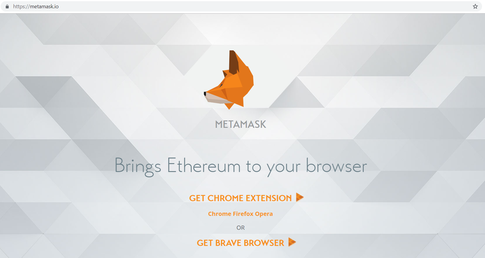
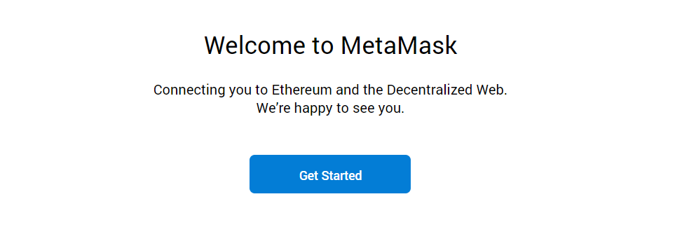
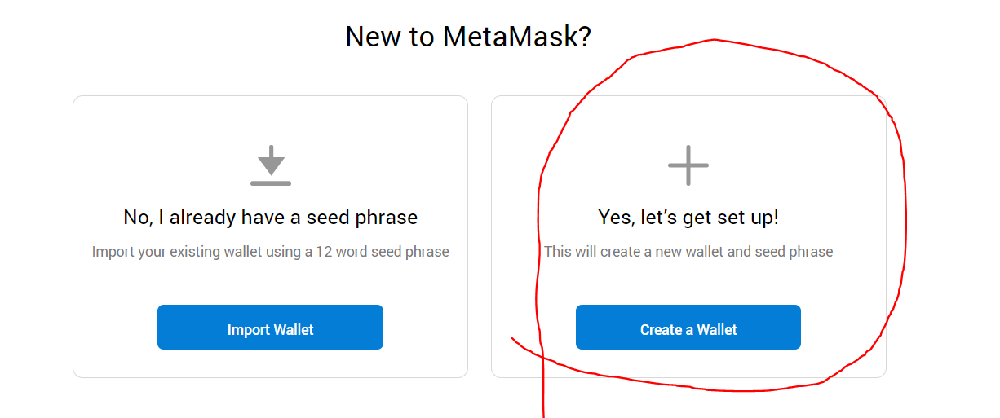
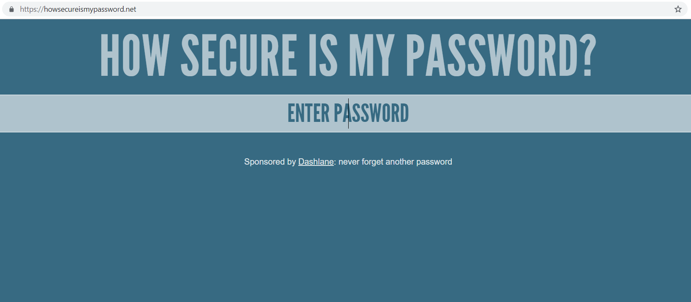
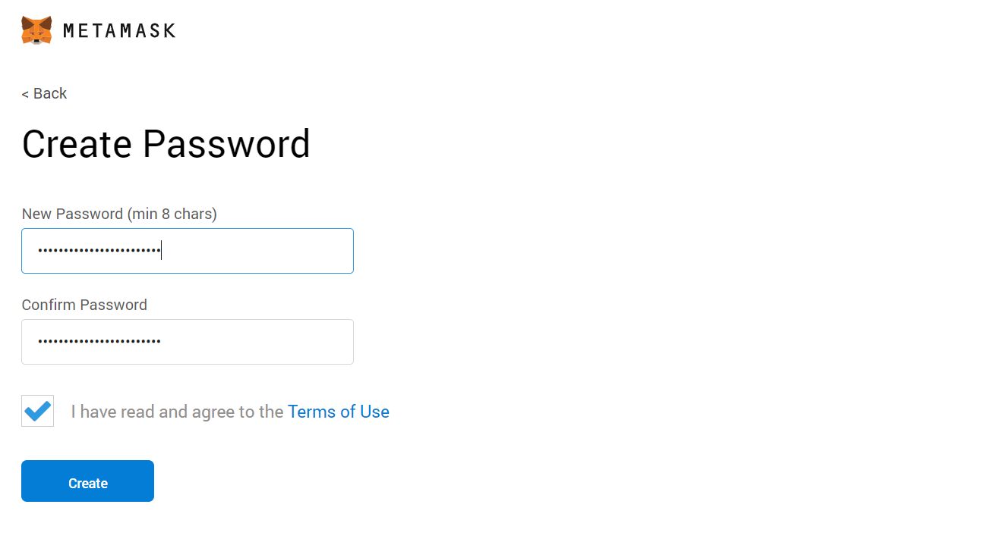
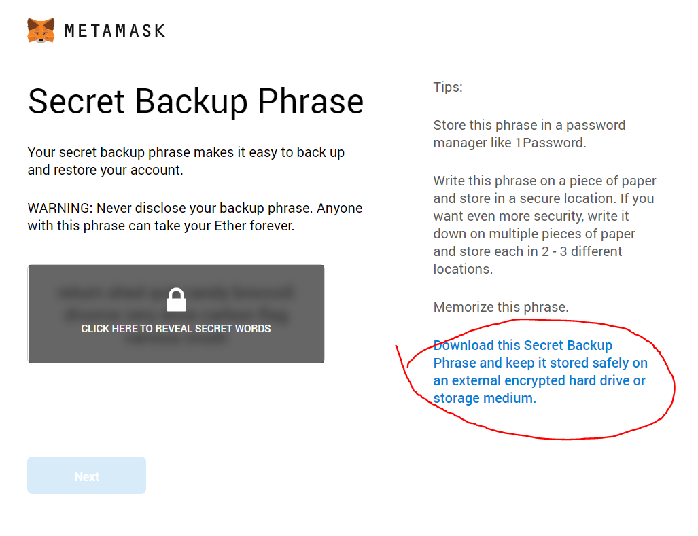
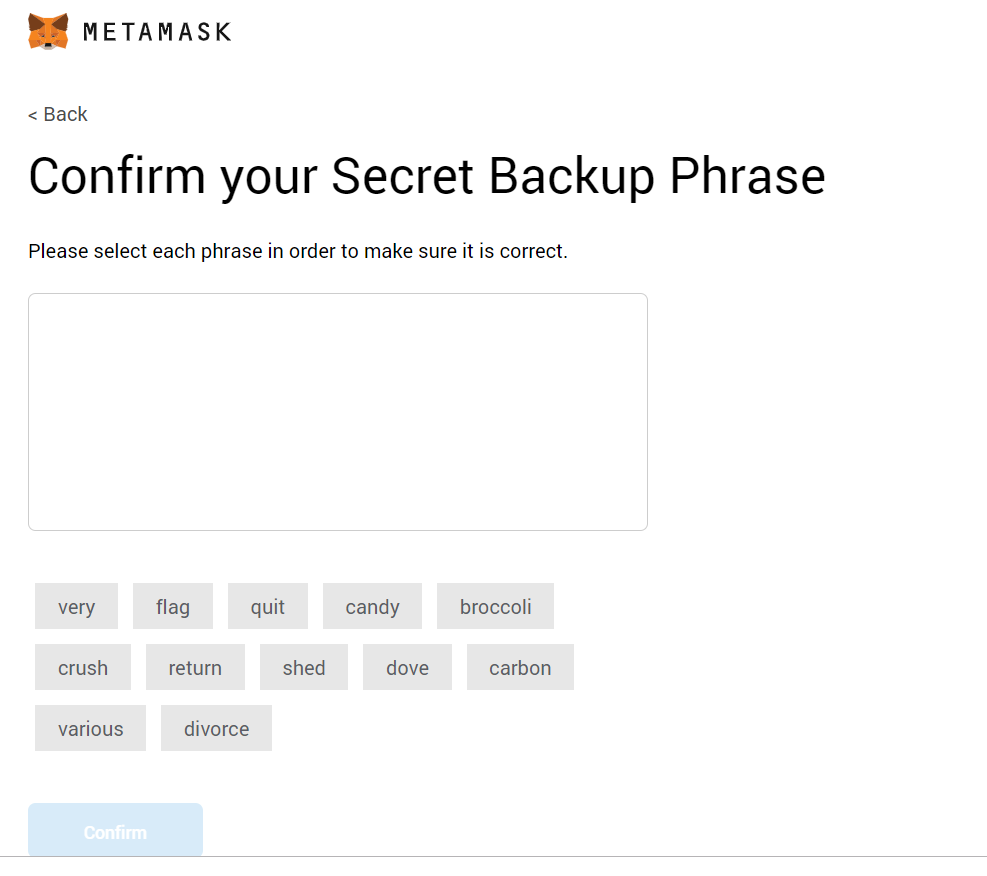
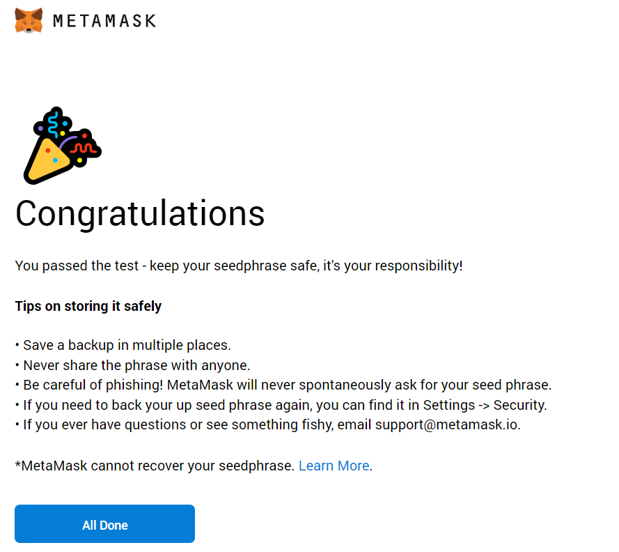
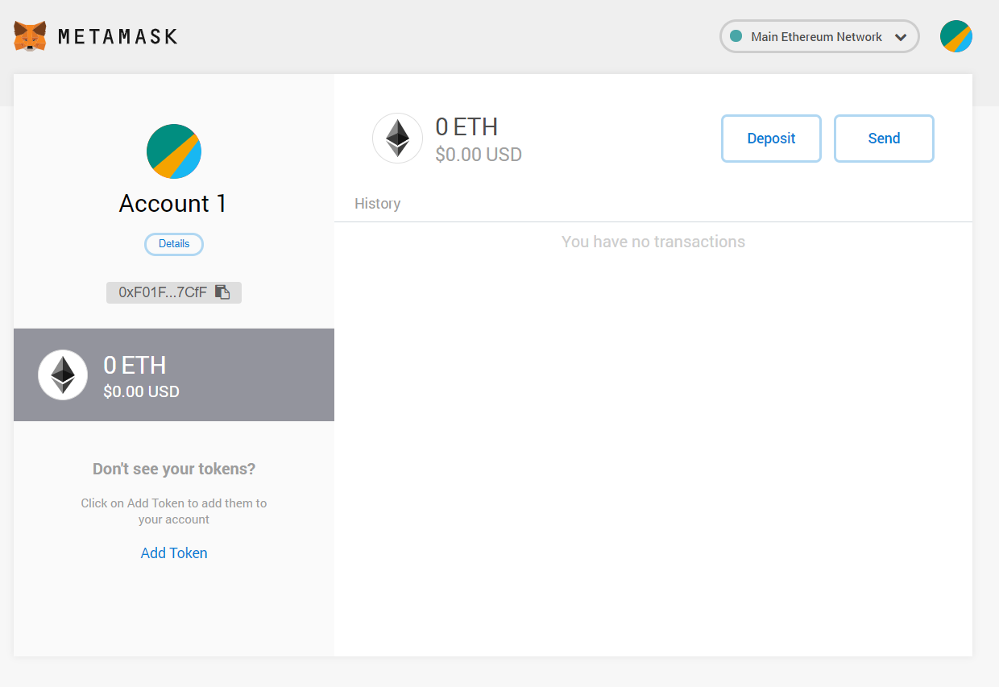
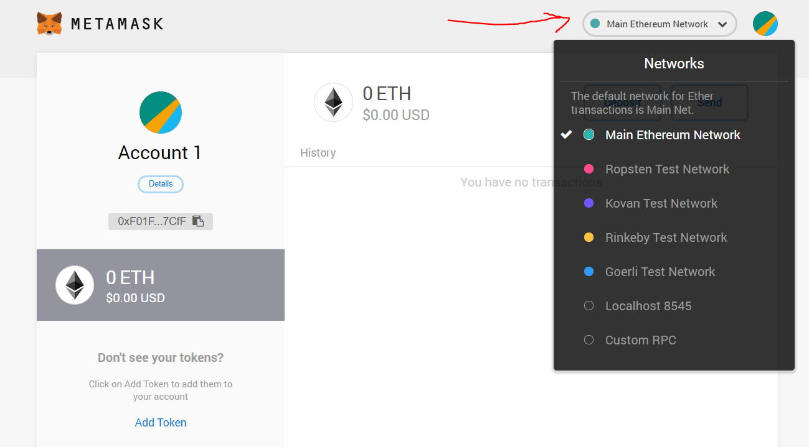

# Module 6a - Beginner Lab: Wallets

## Background
In the context of Bitcoin and cryptocurrencies in general, the term ``wallet" refers to a physical medium, software, or service that keeps track of private and public keys. Wallets facillitate the transactions for sending and receiving cryptocurrency. Ethereum wallets also 

## Meta Information
| Attribute | Explanation |
| - | - |
| Summary | This lab will introduce the student to wallets and help them create their own. |
| Topics | Bitcoin, cryptocurrency, wallets, public key cryptography, security. |
| Audience | CS1 and above. |
| Difficulty | Beginner. |
| Strengths | Wallets are one of the most important concepts in cryptographic currency. |
| Weaknesses | Metamask is just one of many wallet applications. |
| Dependencies | Google Chrome Browser, Internet connection |
| Variants | Same lab could be done with other wallet applications. |

## Assignment Instructions
1. Navigate to [MetaMask](https://metamask.io/) and install the extension for your browser (feel free to watch the introduction video, too).

2. Click the get started button and then click the create a wallet button.

3. Agree or decline the anonymous usage data collection.

4. Create a new, secure password. You can use [How Secure Is My Password](https://howsecureismypassword.net/) to check (be careful of similar services).

5. Enter and confirm your password in MetaMask, and click to acknowledge you agree to the Terms of Use (if you do). Then click create.

6. It is advisable to read the information on the next page and store your mnemonic phrase accordingly. Remember: this is for your eyes only, forever. It is all the information someone needs to someday steal all of the future value you may have in this wallet. And if you lose it, no-one can help you recover it. Click on the link circled in the picture below to save your nmnemonic seed to a text file. Keep this file safe.

7. Confirm you have your mnemonic phrase properly stored and accessible to you by clicking the words on the next page in the correct order. Then proceed, reading along the way, until you see your account balance. You should have 0 ETH ($0.00 USD).

8. In the top right, you should see a dropdown with 'Main Ethereum Network'. Click this and select 'Rinkeby Test Network'.

## Credits
Dr. Debasis Bhattacharya  
Mario Canul  
Saxon Knight  
